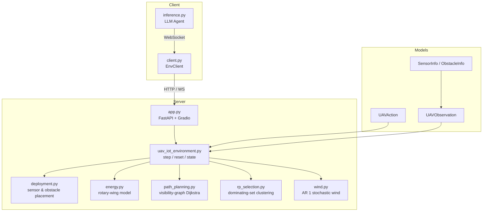

# UAV-Assisted IoT Data Harvesting Environment

An [OpenEnv](https://github.com/openenv-org/openenv) RL environment where an LLM-powered agent controls a UAV to navigate obstacles, collect IoT sensor data, and return to base under energy constraints.

Built around the rotary-wing UAV data-harvesting problem studied in IEEE wireless-networks research (see [References](#references)).

## Why UAV Data Collection?

Autonomous UAV data collection is an active operational problem across industries:

- **Precision agriculture** — drones survey crop-health sensors across large farms where manual collection is too slow
- **Infrastructure monitoring** — collecting readings from bridge, pipeline, and power-line IoT sensors in hard-to-reach locations
- **Disaster response** — harvesting sensor data from flood or earthquake zones where ground access is lost
- **Smart city operations** — energy-constrained drone fleets collecting environmental sensor data across urban areas

Today these routes are planned manually by human operators — a costly, error-prone process. This environment models the core planning challenge: an agent must decide *which* sensors to visit, *in what order*, and *when to return home* — all under a hard energy budget from real propulsion physics.

## Overview

A UAV is deployed over a 2D area with **IoT sensor nodes** and **rectangular obstacles**. Sensors are clustered into **Rendezvous Points (RPs)** via greedy dominating-set. The UAV visits RPs, collects priority-weighted data, and must return to base before battery runs out. Medium, hard, and expert tasks introduce **stochastic wind** that drifts the UAV off course, requiring adaptive navigation.

Unlike toy grid-worlds, every action costs realistic energy (17 J/m flight, 168.5 W hover) from Zeng & Zhang (2017), obstacles require visibility-graph pathfinding, and sensor priorities create non-trivial route-planning tradeoffs.

## Architecture



## Action Space

| Action | Effect |
|--------|--------|
| `move_N/NE/E/SE/S/SW/W/NW` | Move ~50 m in that direction (850 J) |
| `hover_collect` | Hover 10 s to collect data from RPs within 60 m (1685 J) |
| `return_base` | Fly to base via obstacle-aware shortest path |

## Observation Space

| Field | Type | Description |
|-------|------|-------------|
| `uav_x`, `uav_y` | float | UAV position (m) |
| `battery_pct` | float | Battery remaining (0–1) |
| `rps_visited` / `rps_total` | int | Collection progress |
| `data_collected` / `data_possible` | float | Priority-weighted progress |
| `sensors` | list[SensorInfo] | RP positions, priorities, distances |
| `obstacles` | list[ObstacleInfo] | Obstacle bounding boxes |
| `dist_to_base` | float | Distance to base station (m) |
| `wind_x`, `wind_y` | float | Current wind vector (m/s) — 0 on easy |
| `energy_per_move` | float | Joules per 50 m move |
| `done`, `reward`, `message` | — | Step feedback |

## Tasks

| Task | Map | Obstacles | Sensors | Battery | Steps | Wind |
|------|-----|-----------|---------|---------|-------|------|
| `easy` | 400×300 m | 0 | 8 | 600 kJ | 80 | none |
| `medium` | 600×450 m | 3 | 14 | 480 kJ | 120 | 1.0 m/s |
| `hard` | 800×600 m | 5 | 20 | 360 kJ | 160 | 2.0 m/s |
| `expert` | 1000×750 m | 7 | 28 | 300 kJ | 200 | 3.5 m/s |

### Wind Model

Medium, hard, and expert tasks introduce stochastic wind modeled as an AR(1) process. Each step, the wind vector evolves gradually (persistence = 0.8), causing positional drift proportional to `wind_speed × (step_time)`. The agent can observe the current wind vector (`wind_x`, `wind_y`) and must compensate when navigating tight corridors or approaching RPs.

### Scoring (0.0–1.0)

```
score = 0.35 × coverage + 0.25 × priority_ratio + 0.25 × energy_efficiency + 0.15 × safe_return
```

**Energy efficiency** = coverage / energy_fraction_used — rewards collecting more data per unit energy, not idle conservation. An agent that visits all RPs using 50% battery scores 1.0; an agent that does nothing scores 0.0.

## Baseline Results

### Heuristic Baselines (10 seeds each)

| Agent | Easy | Medium | Hard | Expert |
|-------|------|--------|------|--------|
| Random | 0.46 ± 0.10 | 0.38 ± 0.04 | 0.36 ± 0.03 | 0.31 ± 0.04 |
| Nearest-Greedy | 0.99 ± 0.00 | 0.61 ± 0.18 | 0.44 ± 0.16 | 0.33 ± 0.12 |
| Priority-Greedy | 0.99 ± 0.00 | 0.55 ± 0.17 | 0.41 ± 0.13 | 0.30 ± 0.10 |

Performance drops monotonically with difficulty — wind drift and tighter energy budgets make greedy strategies increasingly suboptimal, creating headroom for learned policies.

### LLM Agent (Qwen2.5-Coder-32B-Instruct)

| Task | Score | Notes |
|------|-------|-------|
| easy | 0.97 | All RPs visited, safe return |
| medium | 0.52 | Navigates wind and obstacles with partial coverage |
| hard | 0.38 | Partial coverage — tight battery limits exploration |
| expert | 0.28 | Completes ~30% of RPs under gusty conditions |

The LLM outperforms random on all tasks and approaches greedy on easy, demonstrating that language-based spatial reasoning transfers to this domain.

## Quick Start

```bash
# Install
pip install -e ".[inference]"

# Start environment server
uvicorn uav_iot_env.server.app:app --port 8000

# Run inference (separate terminal)
export HF_TOKEN=your_token
python inference.py
```

### Docker

```bash
docker build -t uav-iot-env .
docker run -p 8000:8000 uav-iot-env
```

## Project Structure

```
├── __init__.py                # Package exports
├── models.py                  # Action, Observation, State (typed)
├── client.py                  # EnvClient wrapper
├── inference.py               # LLM agent with [START]/[STEP]/[END] logs
├── openenv.yaml
├── pyproject.toml
├── uv.lock
├── README.md
└── server/
    ├── Dockerfile
    ├── app.py                 # create_app() entrypoint
    ├── gradio_ui.py           # Custom Gradio visualization tab
    ├── uav_iot_environment.py
    └── simulation/
        ├── __init__.py        # Task configs, reward/physics constants
        ├── deployment.py      # Sensor/obstacle placement
        ├── energy.py          # Rotary-wing energy model
        ├── path_planning.py   # Visibility-graph Dijkstra
        ├── rp_selection.py    # Dominating-set clustering
        └── wind.py            # AR(1) stochastic wind model
```

## Reward Signals

| Event | Reward |
|-------|--------|
| Collect RP | +0.03 × priority |
| Move into obstacle | −0.05 |
| Path blocked | −0.03 |
| Hover, nothing nearby | −0.01 |
| Per-step time penalty | −0.005 |
| Battery depleted (crash) | −1.0 |
| Safe return to base | +0.2 + 0.5 × coverage |
| Stranded (can't reach base) | −0.5 |

## References

This environment is grounded in the UAV-assisted IoT data collection literature:

- **Zeng & Zhang (2017)** — "Energy-Efficient UAV Communication with Trajectory Optimization", *IEEE Trans. Wireless Commun.*, vol. 16, no. 6, pp. 3747–3760. Foundational rotary-wing energy model used in our simulation.
- **Bayerlein et al. (2021)** — "Multi-UAV Path Planning for Wireless Data Harvesting with Deep Reinforcement Learning", *IEEE Open J. Commun. Soc.*, vol. 2, pp. 1171–1187. DDQN with dual global-local map processing for multi-UAV data collection.
- **Wang et al. (2021)** — "Trajectory Design for UAV-Based IoT Data Collection: A Deep Reinforcement Learning Approach", *IEEE Internet Things J.* TD3 for 3D trajectories with imperfect CSI.
- **Chen et al. (2025)** — "LLM-Empowered Decision Transformer for UAV-Enabled Data Collection", *arXiv:2509.13934*. LLM-in-the-loop UAV control with decision transformers.

## Roadmap

- [ ] Multi-UAV cooperative collection with shared energy budget and task allocation
- [ ] 3D trajectory optimization with altitude-dependent energy costs
- [ ] Real sensor deployment data from public IoT datasets
- [ ] PPO/DQN training scripts using the MDP formalization from the analysis notebook

## License

MIT
